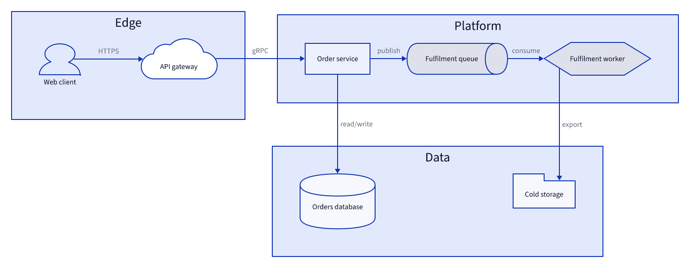

# Order platform architecture

## Elements

- **Web client** (`client`): Browser or MCP-driven agent client.
- **API gateway** (`gateway`): Terminates TLS and routes to the order service.
- **Order service** (`orders`): Owns the order lifecycle state machine.
- **Fulfilment worker** (`worker`): Consumes fulfilment events and drives carrier integrations.
- **Fulfilment queue** (`queue`): Durable work queue between the order service and the worker.
- **Orders database** (`db`): Postgres, one schema per tenant.
- **Cold storage** (`archive`): Nightly export of completed orders for analytics.
- **client → gateway** HTTPS
- **gateway → orders** gRPC
- **orders → queue** publish
- **queue → worker** consume
- **orders → db** read/write
- **worker → archive** export
