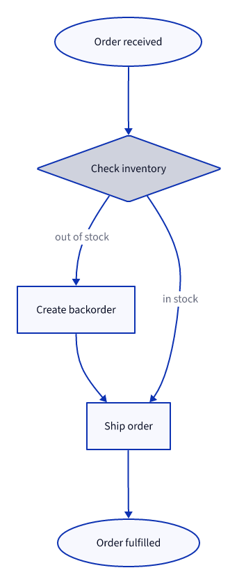

# Order fulfilment

## Elements

- **Order received** (`start`): Submitted via web or MCP.
- **Check inventory** (`check`): Checks the reservation ledger, not raw stock.
- **Create backorder** (`backorder`): Notifies the customer of the delay and reserves the next inbound shipment.
- **Ship order** (`ship`): Hands the order to the configured carrier integration.
- **Order fulfilled** (`done`): Terminal state; triggers the fulfilment webhook.
- **check → ship** in stock
- **check → backorder** out of stock
