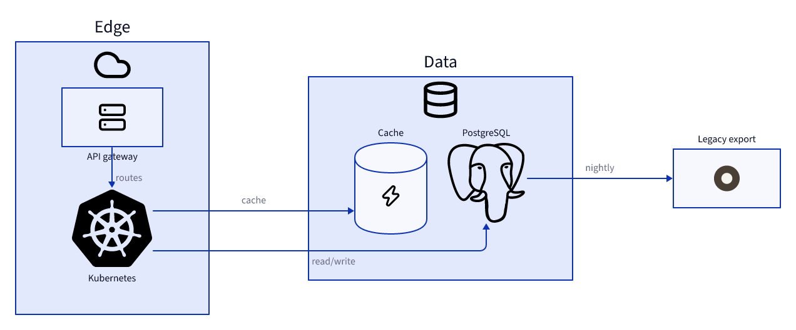

# Order platform with icons

## Elements

- **API gateway** (`gateway`)
- **Kubernetes** (`k8s`)
- **PostgreSQL** (`pg`)
- **Cache** (`cache`)
- **Legacy export** (`legacy`)
- **gateway → k8s** routes
- **k8s → pg** read/write
- **k8s → cache** cache
- **pg → legacy** nightly
