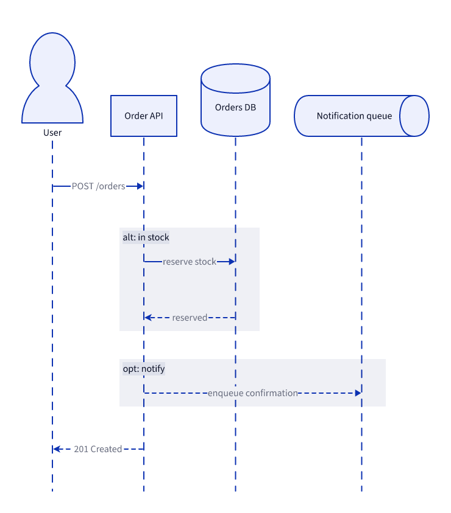

# Place order sequence

## Elements

- **User** (`user`): Customer placing an order via the web client.
- **Order API** (`api`): Public HTTP entrypoint for order operations.
- **Orders DB** (`db`): Postgres store for order state.
- **Notification queue** (`notifier`): Async fan-out for confirmation emails.
- **user → api** POST /orders
- **api → db** reserve stock
- **db → api** reserved
- **api → notifier** enqueue confirmation
- **api → user** 201 Created
