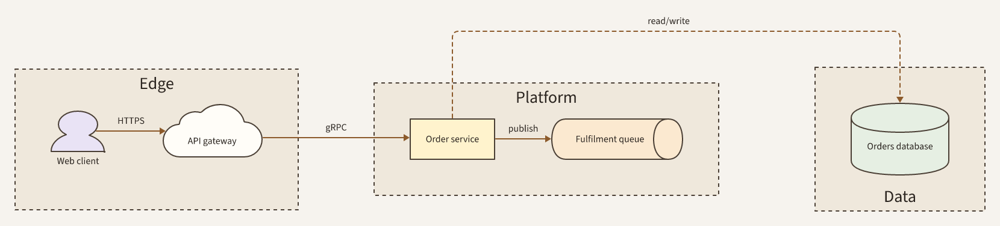

# Order platform (house theme)

## Elements

- **Web client** (`client`)
- **API gateway** (`gateway`)
- **Order service** (`orders`)
- **Fulfilment queue** (`queue`)
- **Orders database** (`db`)
- **client → gateway** HTTPS
- **gateway → orders** gRPC
- **orders → queue** publish
- **orders → db** read/write
